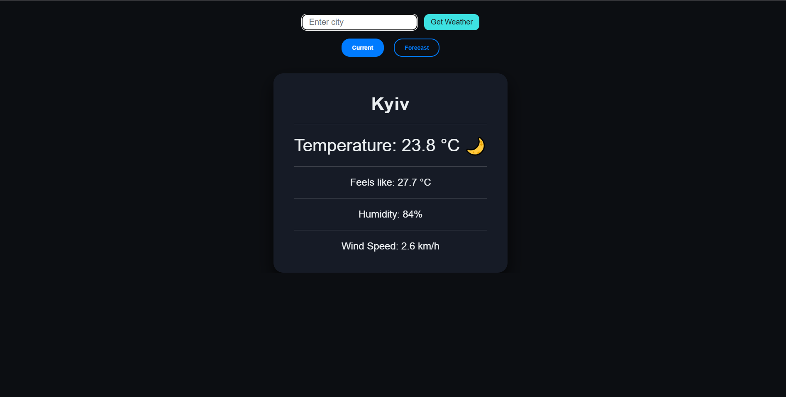
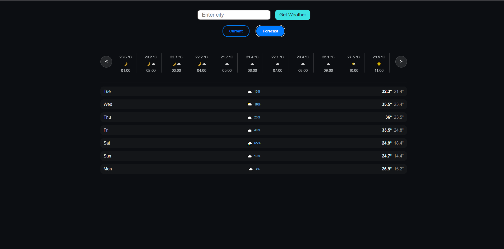

# 🌤️ React Weather Dashboard

A responsive, feature-rich weather application built with React and TypeScript that provides real-time weather updates and detailed forecasts.

## 🚀 Live Demo
[View Live Demo](https://react-weather-app-inky-five.vercel.app/)

## 📸 Screenshots

### Current Weather View


### Detailed Forecast View


## ✨ Features
- **Real-time Weather Data:** Accurate current weather conditions.
- **Detailed Forecasts:** Interactive hourly and daily weather projections.
- **Responsive Layout:** Fully optimized for both mobile and desktop screens using modern CSS Flexbox and media queries.
- **Smooth Navigation:** Custom horizontal scrolling for hourly forecasts, specifically adapted for touch devices.
- **Interactive UI:** Dynamic toggles between 'Current' and 'Forecast' views.
- **Error Handling:** Graceful error messages and loading states.

## 🛠️ Tech Stack
- **Frontend:** React, TypeScript
- **Styling:** Vanilla CSS3 — custom Flexbox layouts, no framework
- **HTTP:** Axios
- **Testing:** Vitest (unit tests)
- **Build Tool:** Vite
- **API:** Open-Meteo (free, no API key required)

## 🧠 Technical Highlights

- **Custom Scroll Mechanics:** Implemented two independent `useRef` hooks to manage seamless horizontal scrolling for the hourly forecast, ensuring a smooth, native-feeling experience on touch devices without relying on external carousel libraries.
- **Advanced Data Processing:** Efficiently processed complex API responses using parallel arrays. Utilized precise array manipulation methods (`findIndex`, `slice`) to extract and display the exact forecast windows needed for the UI.
- **Comprehensive WMO Code Mapping:** Successfully handled all 28 distinct WMO (World Meteorological Organization) weather codes returned by the Open-Meteo API, accurately mapping each edge case to corresponding custom UI icons and descriptions.

## ⚙️ Running Locally

To run this project on your local machine, follow these steps:

1. Clone the repository:

   ```bash
   git clone https://github.com/reminiscensee/react-weather-app.git
   ```
2. Navigate to the project folder:

   ```bash
   cd react-weather-app
   ```
3. Install dependencies:

   ```bash
   npm install
   ```
4. Start the development server:

   ```bash
   npm run dev
   ```

## 📌 Previous Versions
- **v1.0 (Vanilla JavaScript):** (https://github.com/reminiscensee/javascript-weather-app)